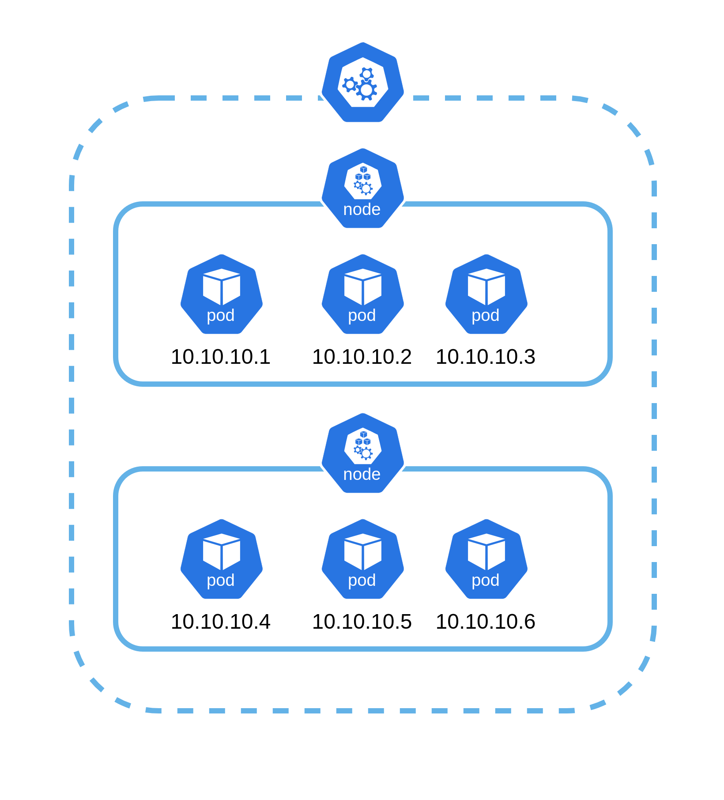

# Kubernetes Network

Dalam mengakses pod atau kontainer dalam kubernetes, kita dapat menggunakan beberapa cara atau metode.

1.  ClusterIP

    ClusterIP digunakan ketika kita ingin menghubungkan antar pods dalam satu cluster kubernetes. Ketika kita ingin menggunakan metode ini, kita bisa langsung menggunakan ketika kita pertama kali membuat sebuah deployment atau pods. Yang mana akses terhadap kontainer bisa dibatasi sesuai dengan kebutuhan dari cluster kubernetes.

    

    IP yang digunakan juga merupakan alokasi secara otomatis dari ClusterIP milik kubernetes. Jadi kita bisa mengakses kontainer tersebut dengan menggunakan kontainer lain.

    Apabila kita ingin me-redirect port tertentu, kita bisa menggunakan service untuk men-define secara langsung port mana yang dipakai.

    Berikut merupakan contoh implementasi dari ClusterIP secara langsung

    ubuntu-pod.yaml

        apiVersion: v1
        kind: Pod
        metadata:
          name: ubuntu
          labels:
            app: ubuntu
        spec:
          containers:
          - name: ubuntu
            image: ubuntu:latest
            command: ["/bin/sleep", "3650d"]
            imagePullPolicy: IfNotPresent
          restartPolicy: Always

    Pada file konfigurasi diatas, kita bisa melihat bahwa kita akan membuat sebuah container dengan menggunakan image dari ubuntu dengan tag latest. Kontainer tersebut diberikan label

        app: ubuntu

    dengan tujuan nantinya akan didefine juga ke service yang melakukan redirect port ke kontainer tersebut.

    Untuk menggunakan file tersebut, kita bisa menggunakan perintah

        kubectl apply -f ubuntu-pod.yaml

    Ketika file tersebut digunakan, maka outputnya akan menjadi seperti ini.

    

    Pada detail dari pods tersebut, kita bisa melihat bahwa kontainer tersebut memiliki IP

        10.244.0.83

    Hal itu karena secara default dari kubernetes akan melakukan assign IP secara random ke kontainer tersebut.

    Untuk selanjutnya kita akan menggunakan service untuk melakukan redirect terhadap port yang sudah kita tentukan. Buat file berikut

    ubuntu-service.yaml

        apiVersion: v1
        kind: Service
        metadata:
          name: ubuntu-service
        spec:
          selector:
            app: ubuntu
          ports:
          - protocol: TCP
            port: 80

    Terapkan file tersebut pada kubernetes

        kubectl apply -f ubuntu-service.yaml

    Hasil nya akan seperti ini

    

    Pada detail tersebut, dapat kita lihat bahwa semua traffic pada port 80 dengan IP Address

        10.99.24.84

    akan dialihkan ke IP yang dimiliki oleh pod ubuntu diatas. Ketika kita melakukan akses ke ip tersebut juga akan memiliki output yang sama.

    Testing dari pod lain pada satu cluster yang sama

    

    

    Dari hasil testing keduanya memiliki output yang sama, yang berarti keduanya mengakses pod yang sama pada port 80.

2.  NodePort Sharing

    Selanjutnya adalah NodePort Sharing. NodePort sharing memiliki konsep yang sedikit berbeda dengan ClusterIP sebelumnya. Perbedaannya hanya ada pada service yang dibentuk. kontainer yang kita miliki bisa diakses melalui jaringan luar yang langsung terhubung dengan Node. Sistemnya seperti kontainer pada docker yang melakukan publish port, sehingga bisa diakses dari jaringan diluar cluster.

    contoh konfigurasi service yang menerapkan metode ini seperti berikut

    ubuntu-service-nodeport.yaml

        apiVersion: v1
        kind: Service
        metadata:
          name: ubuntu-service-nodeport
        spec:
          type: NodePort
          selector:
            app: ubuntu
          ports:
            - protocol: TCP
              port: 80
              nodePort: 30001

    Setelah konfigurasi tersebut diterapkan, maka hasilnya akan menjadi seperti berikut

    

    Untuk membuktikan hasil konfigurasi tersebut, kita bisa mengakses web dari laptop kita sebagai host secara langsung. Sebelum nya kita cek terlebih dahulu ip yang dimiliki oleh node kita.

        kubectl get nodes -o wide

    

    Selanjutnya kita bisa langsung lakukan testing pada browser kita

    

    Metode ini memiliki beberapa kelebihan dan kekurangan. Kelebihannya adalah kita bisa melakukan direct access ke sebuah resource yang ada di cluster kita, namun di sisi lain, karena memang aksesnya langsung ke IP yang dimiliki oleh node kita, maka kita tidak bisa melakukan expose secara masif menggunakan nodeport. Satu lagi kekurangan dari metode ini adalah redirect port yang dilakukan hanya bisa menggunakan range 30000-32767. Jadi metode ini lebih cocok digunakan untuk testing environment yang sudah dibuat agar tidak terlalu banyak yang dikonfigurasi terlebih dahulu.

3.  Load Balancer

    Metode selanjutnya adalah menggunakan load balancer. Seperti load balancer pada umumnya, jadi kita bisa membuat sebuah load balancer yang nantinya berperan sebagai gateway dari jaringan luar untuk mengakses layanan dalam cluster kita. Untuk implementasi sekarang, kita hanya membuat sebuah service yang digunakan untuk menghandle load balancer tersebut. Ada bahasan lain yang akan mendukung load balancer ini yaitu endpoint, akan kita bahas pada materi selanjutnya.

    

    Berikut adalah contoh konfigurasi untuk digunakan sebagai load balancer.

    ubuntu-service-loadbalancer.yaml

        apiVersion: v1
        kind: Service
        metadata:
          name: ubuntu-loadbalancer
        spec:
          type: LoadBalancer
          selector:
            app: ubuntu
          ports:
            - port: 80
          externalTrafficPolicy: Local

    Jangan lupa apply konfigurasi tersebut dan hasilnya akan menjadi seperti ini.

    

    Konfigurasi dari load balancer ini tidak lengkap apabila tidak ditambahkan endpoint tersendiri ke load balancer tersebut. Namun kita tidak akan membahas hal tersebut kali ini.

4.  Ingress

    Selanjutnya adalah menggunakan ingress. Ingress adalah salah satu metode yang bisa kita gunakan untuk menghubungkan cluster kita dengan jaringan luar. Konsepnya hampir sama dengan load balancer, namun ingress mengambil konsep dari gateway API yang melakukan mapping directory. Jadi masing-masing endpoint yang sudah dibuat di dalam cluster dapat diakses melalui pengolahan domain di kubernetes sendiri.

    

    Untuk implementasinya, kita harus mengaktifkan ingress terlebih dahulu dengan menggunakan minikube.

        minikube addons enable ingress

    

    Setelah ingress aktif, siapkan pod yang akan dibuka akses ke luar. Pastikan pod sudah berjalan dan sudah dijalankan dengan servicenya. Kita cukup menggunakan service dengan ClusterIP untuk melakukan expose port dari pod nya.

    

    Setelah kedua hal tersebut sudah berjalan, sekarang kita siapkan ingress nya.

    ubuntu-ingress.yaml

        apiVersion: networking.k8s.io/v1
        kind: Ingress
        metadata:
          name: ubuntu-ingress
          annotations:
            nginx.ingress.kubernetes.io/rewrite-target: /
        spec:
          ingressClassName: nginx
          rules:
          - host: ingress.local
            http:
              paths:
              - path: /
                pathType: Prefix
                backend:
                  service:
                    name: ubuntu-service
                    port:
                      number: 80

    Terapkan konfigurasi tersebut dan konfigurasikan hostname agar bisa terbaca di host kita. Untuk host saya sendiri perlu mengkonfigurasi pada file /etc/hosts.

    Disini saya akan menggunakan host 'ingress.local' sesuai dengan konfigurasi diatas.

    /etc/hosts

    

    Setelah itu kita coba akses melalui browser.

    

    Ingress lebih cocok digunakan untuk layanan yang berbasis HTTP dikarenakan ingress hanya mengsupport protokol HTTP/HTTPS. Untuk implementasi protokol yang lain, kubernetes telah dikembangkan menjadi gateway API yang bisa menghandle request yang lebih kompleks. Topik tersebut akan kita bahas pada waktu yang lain.
